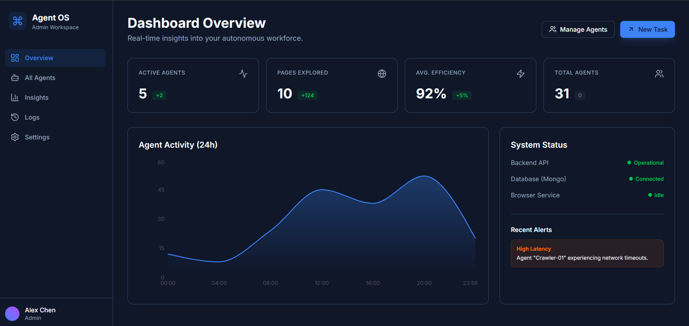
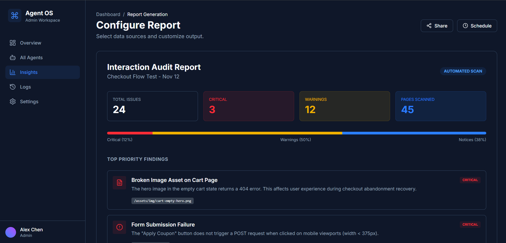
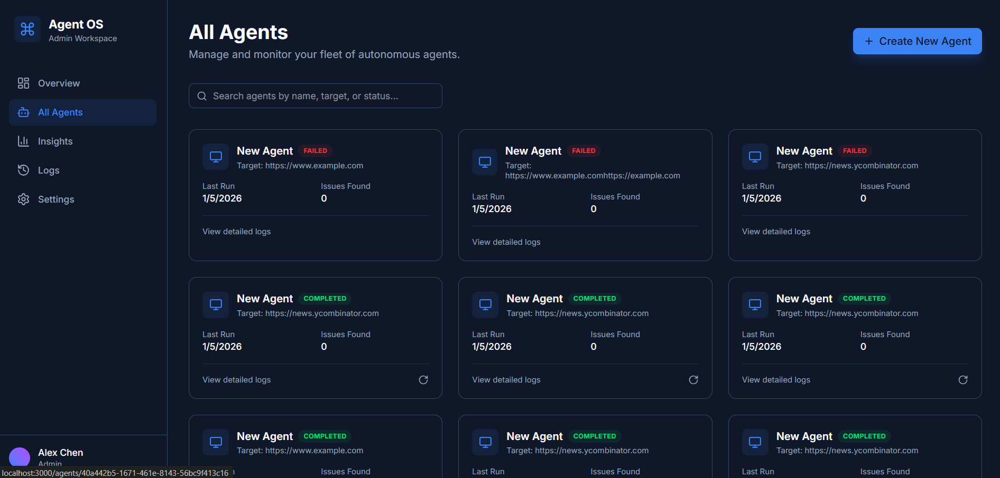
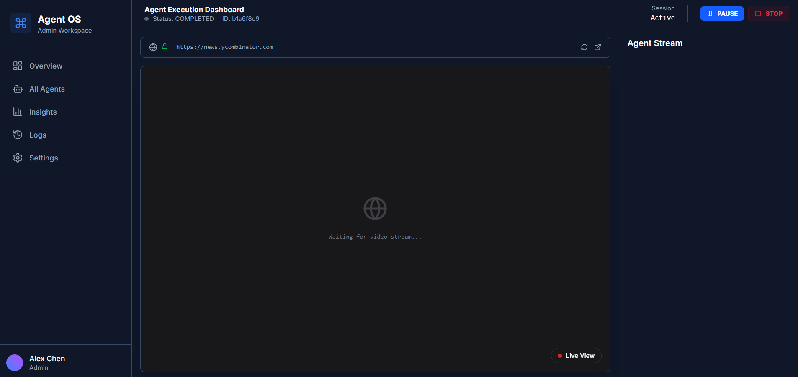

# Semi-Autonomous Web Interaction Agent

## Screenshots


*Main dashboard showing agent statistics and overview*


*All agents view with status and metrics*


*Live agent dashboard with video stream and logs*


*Agent configuration and deployment interface*

## Problem Statement

Modern websites are dynamic, complex, and constantly evolving. Traditional scripted testing approaches fail to capture:
- **Runtime behaviors** that only manifest under specific conditions
- **Subtle UX issues** like broken navigation flows or confusing interactions
- **Unexpected edge cases** that weren't anticipated during test design
- **Cross-page dependencies** that require contextual understanding

This project implements a **semi-autonomous agent** that can explore websites intelligently, make runtime decisions based on what it observes, and identify potential issues without requiring pre-written test scripts.

## Chosen Focus

**Intelligent Web Exploration with Anomaly Detection**

The agent focuses on:
1. **Autonomous navigation** - Exploring websites by following links and making decisions about which paths to take
2. **Runtime decision-making** - Using heuristics and state tracking to decide next actions based on page content
3. **Behavioral observation** - Monitoring page structure, navigation patterns, and interaction outcomes
4. **Issue detection** - Identifying broken links, navigation dead-ends, and structural anomalies

## Architecture

### System Overview

```
┌─────────────────────────────────────────────────────────────┐
│                       Frontend (Next.js)                     │
│  ┌──────────────┐  ┌──────────────┐  ┌──────────────┐      │
│  │   Dashboard  │  │  Agent List  │  │ Agent Detail │      │
│  │   (Stats)    │  │   (Cards)    │  │ (Live View)  │      │
│  └──────────────┘  └──────────────┘  └──────────────┘      │
│         │                  │                  │              │
│         └──────────────────┴──────────────────┘              │
│                            │                                 │
│                     WebSocket + REST API                     │
└────────────────────────────┬────────────────────────────────┘
                             │
┌────────────────────────────┴────────────────────────────────┐
│                    Backend (FastAPI)                         │
│  ┌──────────────────────────────────────────────────────┐   │
│  │              Agent Orchestration Layer                │   │
│  │  • WebSocket Manager (real-time events)              │   │
│  │  • Agent Lifecycle Management                         │   │
│  │  • Video Stream Broadcasting                          │   │
│  └──────────────────────────────────────────────────────┘   │
│                             │                                │
│  ┌────────────────┬─────────┴────────┬────────────────┐    │
│  │                │                   │                 │    │
│  │  AgentService  │  DecisionEngine  │   Repository    │    │
│  │  (Playwright)  │   (Heuristics)   │   (Data Layer)  │    │
│  │                │                   │                 │    │
│  │ • Browser      │ • Page Analysis  │ • Agent CRUD    │    │
│  │   Control      │ • Link Tracking  │ • Log Storage   │    │
│  │ • Screenshot   │ • Action         │ • Stats         │    │
│  │   Capture      │   Selection      │   Tracking      │    │
│  │ • Navigation   │ • State Memory   │                 │    │
│  └────────────────┴──────────────────┴────────────────┘    │
│                             │                                │
└─────────────────────────────┼────────────────────────────────┘
                              │
                    ┌─────────┴─────────┐
                    │   MongoDB Atlas   │
                    │  • Agents         │
                    │  • Logs           │
                    │  • Statistics     │
                    └───────────────────┘
```

### Core Components

#### 1. **AgentService** (`agent_service.py`)
- **Browser automation** using Playwright (Chromium)
- **Video streaming** - Captures screenshots at 10 FPS and broadcasts via WebSocket
- **Action execution** - Navigate, click, scroll, wait
- **Event emission** - Logs all actions and observations to UI and database

#### 2. **DecisionEngine** (`decision_engine.py`)
- **Intelligent link selection** using heuristics
- **State tracking** - Remembers visited URLs to avoid loops
- **Domain awareness** - Stays within the target website's domain
- **Priority-based decisions**:
  1. Explore unvisited internal links first
  2. Re-explore visited links for deeper navigation
  3. Wait if no actionable elements found

#### 3. **Frontend Dashboard** (Next.js + React)
- **Real-time video stream** showing agent's browser view
- **Live event logs** displaying agent's reasoning and actions
- **Agent management** - Create, monitor, and track multiple agents
- **Statistics dashboard** - Aggregate metrics across all agents

## Decision Logic

### Exploration Strategy

The agent uses a **stateful, heuristic-based approach** to navigate websites:

```python
def decide_next_action(analysis):
    # Priority 1: Explore unvisited internal links
    if unvisited_links_exist:
        link = select_random_unvisited_link()
        mark_as_visited(link)
        return NAVIGATE(link)
    
    # Priority 2: Re-explore visited links for deeper paths
    if any_links_exist:
        link = select_random_link()
        return NAVIGATE(link)
    
    # Priority 3: No actionable elements
    return WAIT()
```

### Key Design Decisions

1. **Random selection over deterministic**: Introduces variability to discover different paths on each run
2. **Internal link filtering**: Prevents the agent from leaving the target domain
3. **Visit tracking**: Avoids infinite loops while allowing re-exploration
4. **Text-based link filtering**: Ignores navigation/footer links (< 2 chars or > 100 chars)

### Autonomy Levels

The system supports three autonomy modes (configurable in UI):

- **Passive Observer**: Read-only mode, no interactions
- **Active Explorer**: Navigates links and performs basic interactions (current implementation)
- **Deep Interactor**: Full autonomy including form submission and auth flows (future)

## Runtime Decision-Making Examples

### Example 1: Hacker News Exploration
```
1. Start at https://news.ycombinator.com
2. Analyze page → Find 165 links (all unvisited)
3. Decision: Navigate to "login" (random unvisited link)
4. Analyze login page → Find 8 links (all unvisited)
5. Decision: Navigate to "forgot password" 
6. Continue for 20 iterations or until no links remain
```

### Example 2: Detecting Navigation Issues
```
1. Navigate to page with broken link
2. Observe: Navigation failed (404 error)
3. Log: ERROR event with details
4. Decision: Try alternative link
5. Track: Increment issues_found counter
```

## Observations & Insights

The agent automatically logs:

- **Page structure analysis**: Link count, button count, form inputs
- **Navigation decisions**: Which link was chosen and why
- **Action outcomes**: Success/failure of each interaction
- **Anomalies**: Broken links, unexpected errors, navigation dead-ends

### Sample Agent Log Output
```
INFO: Browser session initialized
NAVIGATE: Navigated to https://news.ycombinator.com
OBSERVATION: Page Analyzed - Found 165 links (165 unvisited), 0 buttons
ANALYSIS: Deciding next move: NAVIGATE - Exploring unvisited link: login
NAVIGATE: Navigated to https://news.ycombinator.com/login
OBSERVATION: Page Analyzed - Found 8 links (8 unvisited), 2 buttons
ANALYSIS: Deciding next move: NAVIGATE - Exploring unvisited link: forgot password
```

## Technical Implementation

### Technologies Used

**Backend:**
- FastAPI (async web framework)
- Playwright (browser automation)
- Motor (async MongoDB driver)
- BeautifulSoup4 (HTML parsing)
- WebSockets (real-time communication)

**Frontend:**
- Next.js 14 (React framework)
- TypeScript
- Tailwind CSS
- Lucide Icons

**Database:**
- MongoDB (agent state, logs, statistics)

### Key Features

1. **Real-time Video Streaming**
   - 10 FPS JPEG screenshots
   - Base64 encoding for WebSocket transmission
   - FPS counter overlay

2. **Concurrent Agent Support**
   - Multiple agents can run simultaneously
   - Each agent maintains independent state
   - Task tracking prevents garbage collection

3. **Persistent State**
   - All agent runs stored in MongoDB
   - Full event logs for post-analysis
   - Statistics aggregation across runs

## Challenges & Solutions

### Challenge 1: Background Task Execution
**Problem**: FastAPI `BackgroundTasks` terminated long-running agent loops prematurely.

**Solution**: Switched to `asyncio.create_task()` with task reference tracking to prevent garbage collection.

### Challenge 2: Database Connection in Standalone Tests
**Problem**: Agent service crashed when database wasn't connected.

**Solution**: Made database logging optional with try-except blocks and null checks.

### Challenge 3: Video Stream Synchronization
**Problem**: Frontend showed "Waiting for video stream" even when agent was running.

**Solution**: Implemented continuous 10 FPS streaming loop that runs parallel to agent execution.

## Future Enhancements

1. **LLM Integration**: Use GPT-4 Vision to analyze screenshots and make intelligent decisions
2. **Form Interaction**: Automatically fill and submit forms with test data
3. **Accessibility Testing**: Detect WCAG violations and missing alt text
4. **Performance Monitoring**: Track page load times and identify slow pages
5. **Visual Regression**: Compare screenshots across runs to detect UI changes
6. **Smart Issue Classification**: Categorize detected issues by severity and type

## Running the Project

### Prerequisites
- Python 3.9+
- Node.js 18+
- MongoDB (local or Atlas)

### Backend Setup
```bash
cd backend
pip install -r requirements.txt
playwright install chromium
uvicorn main:app --reload
```

### Frontend Setup
```bash
cd frontend
npm install
npm run dev
```

### Access
- Frontend: http://localhost:3000
- Backend API: http://localhost:8000
- API Docs: http://localhost:8000/docs

## Conclusion

This project demonstrates a **semi-autonomous approach to web testing** that goes beyond traditional scripted tests. By combining browser automation, intelligent decision-making, and real-time observation, the agent can explore websites dynamically and identify issues that would be difficult to catch with static test cases.

The key innovation is the **runtime decision engine** that adapts to what it sees on each page, making it suitable for testing dynamic, evolving websites where pre-written scripts quickly become outdated.
